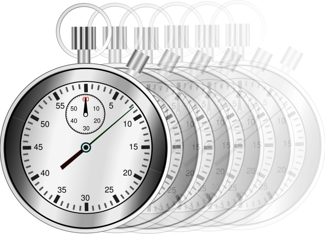

# Long Count 
<div style="padding:20px" align="center">
</img>
</div>

# Introduction
**Long Count** is a library of **`setInterval`** and **`setTimeout`** functions producing a **`LongCounter`** instance capable of handling superbly long delay times and surviving device sleep and wake cycles.

### Name:
<strong>@webkrafters/long-count</strong><br />
<strong>Alternate:</strong> long-count.js

# Installation
npm install --save @webkrafters/long-count

# Usage

## Timeout

```tsx
import type {
    Delay,
    Options,
    VoidFn
} from '@webkrafters/long-count';

import {
    clearTimeout,
    setTimeout
} from '@webkrafters/long-count';

const timeout = setTimeout(
    callback : VoidFn,
    delay? : Delay,
    options? : boolean | Partial<Options>,
    ...args : Array<any>
); // => LongCounter

clearTimeout( timeout );
// or clearTimeout( timeout.id );
// or clearTimeout( timeout.valueOf() );
```

## Interval

```tsx
import type {
    Delay,
    Options,
    VoidFn
} from '@webkrafters/long-count';

import {
    clearInterval,
    setInterval
} from '@webkrafters/long-count';

const interval = setInterval(
    callback : VoidFn,
    delay? : Delay,
    options? : boolean | Partial<Options>,
    ...args : Array<any>
); // => Interval (a child LongCounter)

clearInterval( interval );
// or clearInterval( interval.id );
// or clearInterval( interval.valueOf() );
```

# Events

The `LongCounter` instance is an observable notifying observers of the events.<br />
*See **[Event Types](#etypes)** in the next section.* 

```tsx
import type {
    EventType,
    VoidFn
} from '@webkrafters/long-count';

import { setTimeout } from '@webkrafters/long-count';

const timeout = setTimeout( ... ); // => LongCounter
timeout.addEventListener(
    eventType : EventType,
    listener : VoidFn
); // => void
timeout.dispatchEvent(
    eventType : EventType,
    ...args : Array<any>
); // => void
timeout.removeEventListener(
    eventType : EventType,
    listener : VoidFn
); // => void

```

<h2 id="etypes">Event Types</h2>
<table BORDER=2>
    <thead>
        <tr>
            <td><strong>Type</strong></td>
            <td><strong>Event observed</strong></td>
        </tr>
    </thead>
    <tbody VALIGN=TOP>
        <tr>
            <td><strong>cycleEnding</strong></td>
            <td>
                End of a delay segment. A delay segment equals the platform time delay limit or the entire delay when less than the device limit.
            </td>
        </tr>
        <tr>
            <td><strong>cycleStarted</strong></td>
            <td>
                Start of a delay segment. A delay segment equals the platform time delay limit or the entire delay when less than the device limit.
            </td>
        </tr>
        <tr>
            <td><strong>exit</strong></td>
            <td>
                Eve of a LongCounter disposal.
            </td>
        </tr>
        <tr>
            <td><strong>resume</strong></td>
            <td>
                Page receiving visibility (e.g. when <strong>waking</strong> from device "sleep" mode).
            </td>
        </tr>
        <tr>
            <td><strong>suspend</strong></td>
            <td>
                Page losing visibility (e.g. when <strong>entering</strong> device "sleep" mode).
            </td>
        </tr>
    </tbody>
</table>

# License
MIT